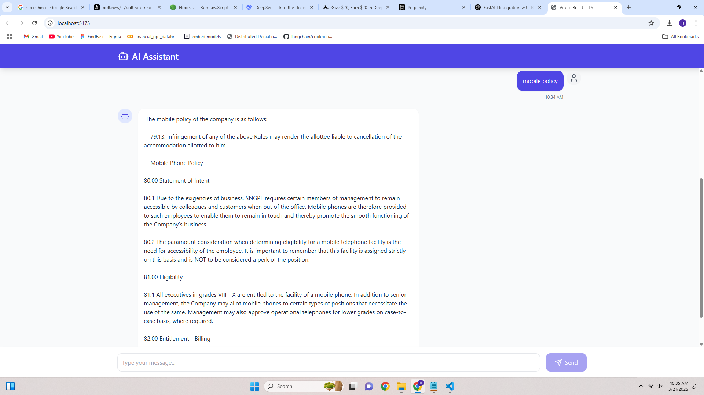

# Professional UI Chatbot

A modern and responsive chatbot UI built with React, TypeScript, TailwindCSS, and Vite. This chatbot provides a seamless user experience with features like error handling, loading indicators, and a clean, professional design.



## Features

- **Real-time Chat**: Communicate with the AI assistant in real-time.
- **Error Handling**: Displays appropriate error messages for network or server issues.
- **Responsive Design**: Fully responsive and optimized for all screen sizes.
- **Loading Indicators**: Shows a typing indicator while the AI is processing.
- **Customizable**: Easily extendable and customizable for your needs.

## Technologies Used

- **React**: For building the user interface.
- **TypeScript**: For type safety and better developer experience.
- **TailwindCSS**: For styling the application.
- **Vite**: For fast development and build tooling.
- **Axios**: For making HTTP requests.

## Getting Started

### Prerequisites

- Node.js (v16 or later)
- npm or yarn

### Installation

1. Clone the repository:

   ```bash
   git clone https://github.com/your-username/professional-ui-chatbot.git
   cd professional-ui-chatbot
   ```

2. Install dependencies:

   ```bash
   npm install
   # or
   yarn install
   ```

3. Start the development server:

   ```bash
   npm run dev
   ```

4. Open your browser and navigate to `http://localhost:5173`.

### Build for Production

To build the project for production, run:

```bash
npm run build
```

The production-ready files will be in the `dist` folder.

## Screenshot


## License

This project is licensed under the MIT License. See the [LICENSE](LICENSE) file for details.

## Contributing

Contributions are welcome! Please open an issue or submit a pull request for any improvements or bug fixes.

---